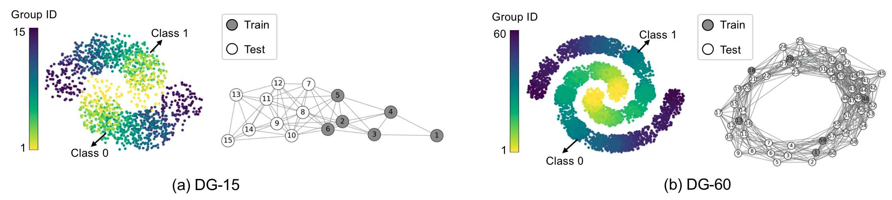

# Topology-aware Robust Optimization for Out-of-Distribution Generalization (TRO)

This repository holds the Pytorch implementation of [Topology-aware Robust Optimization for Out-of-Distribution Generalization](https://openreview.net/forum?id=ylMq8MBnAp) by Fengchun Qiao and Xi Peng.
If you find our code useful in your research, please consider citing:

```
@inproceedings{qiao2023tro,
title={Topology-aware Robust Optimization for Out-of-Distribution Generalization},
author={Fengchun Qiao and Xi Peng},
booktitle={International Conference on Learning Representations (ICLR)},
year={2023}
}
```

## Introduction

We study the problem of out-of-distribution (OOD) generalization.
As generalizing to arbitrary test distributions is impossible, we hypothesize that further structure on the topology of distributions is crucial in developing strong OOD resilience. 
To this end, we propose topology-aware robust optimization (TRO) that seamlessly integrates distributional topology in a principled optimization framework.


## Quick start
This repository reproduces our results on DG-15/60, TPT-48, and DomainBed, which is build upon Python3 and Pytorch v1.9.0 on Ubuntu 18.04.
Please install all required packages by running:

```
pip install -r requirements.txt
```

## Results on DG-15/60

Illustration of data groups in (a) DG-15 and (b) DG-60 datasets:



To reproduce the results of TRO with physical-based topology on DG-15, please run:

```
python main.py --dataset toy_d15 --learn 0 --model TRO
```

To reproduce the results of TRO with data-driven topology on DG-15, please run:

```
python main.py --dataset toy_d15 --learn 1 --model TRO
```

To reproduce the results on DG-15, please change `--dataset` to `toy_d60`.
You can also reproduce the results of other baselines by changing `--model`.

## TODO

- [ ] TPT-48
- [ ] DomainBed 


## Acknowledgement

Part of our code is borrowed from the following repositories.

- [GRDA](https://github.com/Wang-ML-Lab/GRDA)
- [DiffusionEMD](https://github.com/KrishnaswamyLab/DiffusionEMD)
- [DomainBed](https://github.com/facebookresearch/DomainBed)

We thank to the authors for releasing their codes. Please also consider citing their works.